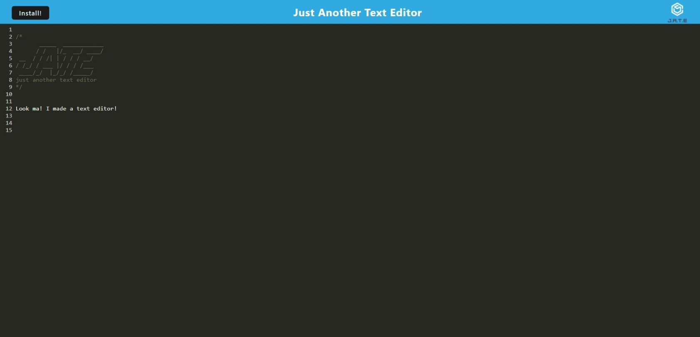

# bjText: Text Editor

## Your Task


Your task is to build a text editor that runs in the browser. The app will be a single-page application that meets the PWA criteria. Additionally, it will feature a number of data persistence techniques that serve as redundancy in case one of the options is not supported by the browser. The application will also function offline.

This application employs indexDB as a storage solution for saving notes, code snippets, and other user-selected data. It can be installed and run offline, thanks to a service worker that caches data in the background. The project was built, bundled, and optimized using Webpack and Workbox for efficient performance.

## User Story

```md
AS A developer
I WANT to create notes or code snippets with or without an internet connection
SO THAT I can reliably retrieve them for later use
```

## Link

https://dry-peak-88577.herokuapp.com/


## Screenshot



## Installation
To install necessary dependencies, run the following command:

  ` npm i `

## Usage
check the package.json file for helpful scripts!

## License

[](https://opensource.org/licenses/MIT)

MIT
Copyright 2023 rjclemmer

Permission is hereby granted, free of charge, to any person obtaining a copy of this software and associated documentation files (the "Software"), to deal in the Software without restriction, including without limitation the rights to use, copy, modify, merge, publish, distribute, sublicense, and/or sell copies of the Software, and to permit persons to whom the Software is furnished to do so, subject to the following conditions:
    
The above copyright notice and this permission notice shall be included in all copies or substantial portions of the Software.
    
THE SOFTWARE IS PROVIDED "AS IS", WITHOUT WARRANTY OF ANY KIND, EXPRESS OR IMPLIED, INCLUDING BUT NOT LIMITED TO THE WARRANTIES OF MERCHANTABILITY, FITNESS FOR A PARTICULAR PURPOSE AND NONINFRINGEMENT. IN NO EVENT SHALL THE AUTHORS OR COPYRIGHT HOLDERS BE LIABLE FOR ANY CLAIM, DAMAGES OR OTHER LIABILITY, WHETHER IN AN ACTION OF CONTRACT, TORT OR OTHERWISE, ARISING FROM, OUT OF OR IN CONNECTION WITH THE SOFTWARE OR THE USE OR OTHER DEALINGS IN THE SOFTWARE.;

## Questions
If you have any questions about the repo, open an issue or contact me directly at clemmer.robert.j@gmail.com. You can find more of my work on GitHub at [rjclemmer](https://github.com/rjclemmer).

## Code-Source
Class assignments were used for structure and ChatGPT was used for helping with comments.